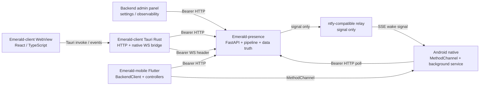

# 三仓接口总览与闭环审计

> **状态**：current implementation catalog
> **核对日期**：2026-08-11
> **覆盖仓库**：`Emerald-presence`（后端）、`Emerald-client`（桌面）、`Emerald-mobile`（手机）

本文是三仓之间的接口总账和功能闭环检查入口。它整理 HTTP、WebSocket、Tauri IPC、Android
`MethodChannel`、手机主动消息中继，以及“设置 / 观测 / 回归调用链”的关系。它不是单仓代码
实现的替代品：精确 schema 仍以运行中的 `/openapi.json` 和对应源码为准，具体桌面消息字段仍
以 `Emerald-client/docs/protocol-v0.md` 为准。

## 1. 系统边界与权威来源

### 生活记录手机先行（2026-09-11）

- `roadmap`：饮食/账单/购物车图片的识别、正式数据、角色只读检索、管理面开关与 scoped auth；后端工单 `cc-tasks/245-life-records-backend-handoff.md`。本轮仅交接文档，未新增后端代码或实际 HTTP 路由。
- `open`：`/life-records/capabilities`、`/life-records/sync`、列表/详情和 `/life-records/observability` 均为 proposed。enabled 默认 false，background_sync 与角色读取由后端 effective state 决定；观测、审计和删除清理必须与存储同单交付。
- 手机侧独立 Flutter controller/widget 与 Android 私有 SQLite outbox、源图、JobScheduler；队列绑定 origin+owner，操作 ID 幂等、revision 冲突保留、匹配 ack 才清队列。采用独立 `presence_mobile/life_records` channel，不改 legacy settings、聊天 ingest、mobile poll/ack、通知/中继或自动付款链路。
- `observe`：手机本机测试/Dev 构建证据见手机工单 17；真实后端及真机后台网络矩阵待联调。淘宝直连导入、桌面记录 UI、上传后原图跨端重取列 roadmap，不把接口草案写成功能完成。

### 管理面分组导航与页面指南（2026-09-10）

- `current`：管理面恢复可折叠分类及细页直达；底部文档提供任务路线、术语解释和
  62 个页面快捷入口。面板内返回记录本标签页访问顺序，保留已挂载页面的输入与滚动。
  详见 `docs/admin-navigation-guide.md`。
- `current`：沿用既有页面、API 与 scope；只有浏览器本地导航状态，无新增服务端
  落盘、配置或观测接口。桌面 `open_admin_panel` 桥接、手机设置和 relay 契约不变。
- `observe`：本地真实静态资源的 Chromium 桌面/窄屏验证通过，业务 API 被测试拦截；
  未以真实 token 验证登录、桌面原生窗口或手机 WebView，本次不声明这些链路完成联调。

### API 思考独立存档（2026-09-09）

- `current`：协议边界默认保存实际返回的 thinking/reasoning/inline 标签内容，独立
  SQLite 存储走 sandbox，不写对话记忆或广播。保留期无限，写入失败不阻断生成。
- `current`：admin-only `GET /observability/llm-reasoning` 支持 limit/before/model，
  列表为元数据；`GET /observability/llm-reasoning/{call_id}` 返回 parts 思考文本。
  call_id 每次 API 尝试独立，重试不覆盖；正常完成和中断分开标记。
- `roadmap`：管理页/双端展开 UI、chat turn_id 关联、客户端适用的受限读取契约。
  不给标准 desktop/mobile token 扩大权限，不改变现有 HTTP/WS 回复、ack、TTL 或中继。
- `observe`：真实中转与真机验收尚未完成；本地测试不代表所有网关思考字段均可获取。

### Owner chat 空回复边界（2026-09-09）

- `current`：`/mobile/chat` 与 `/desktop/chat` 共用入口在生成（含工具循环 fallback）
  结束后拒绝空/纯空白正文，返回 HTTP 502，detail 为安全重试/切换预设提示；不进
  turn sink，不产生 assistant 历史、广播或 mobile mirror。既有鉴权和成功字段不变。
- `current`：沿用模型路由管理面，不增加设置或落盘状态；后端记录不含正文的 warning。
  回归验证同一用户失败后可继续发送，桌面空流仍发送既有 stream_end。
- `observe`：手机 BackendClient 消费错误 detail，ChatController finally 释放发送状态；
  桌面 5xx 仍走通用错误。真实中转和双端 UI 连续失败恢复尚未实测，详见 known-issues。
- `current`：LLM 空输出诊断沿用后端日志，仅记录协议、结束原因和内容长度/工具数，
  不新增响应正文落盘、REST/WS 字段或客户端设置；上游根因仍为 `observe`。

### Image recognition routing (2026-09-09)

- `current`, `admin-only`: `GET/PUT /image-recognition` configures upload mode and
  independent OCR with explicit `glm_layout_parsing`/`chat_completions`. GET returns
  redacted fields, configured/effective state and request URL. Model Routing owns editing.
- `current`: QQ and `/upload/ingest` images use the selected route; existing upload schema,
  owner scope, attachment hashes and delivery paths remain compatible. Desktop Rust and
  Flutter `BackendClient` retain the same upload endpoint; phone automation inherits
  `vision`, never OCR. No new client setting or secret distribution is required.
- `current`: `/observability/api-calls?caller=image_ocr` (`state.read`) exposes call
  metadata; image cache validity includes the recognition connection signature.
- `observe`: real GLM credentials and physical desktop/mobile uploads need deployment
  verification. Local mocks and admin browser tests do not establish provider availability.
  PDF parsing and combined scene-plus-OCR routing remain `roadmap`.



| 层 | 当前权威 | 说明 |
|---|---|---|
| 后端 REST | `Emerald-presence/admin/admin_server.py`、`admin/routers/*.py`、`/openapi.json` | 路由、鉴权依赖、请求/响应 schema 和业务真值 |
| 后端通道 | `channels/desktop_ws.py`、`channels/mobile.py`、`channels/relay_publisher.py` | WS 帧、mobile durable queue、relay signal-only |
| 桌面 HTTP/WS 桥 | `Emerald-client/src-tauri/src/lib.rs`、`src-tauri/src/ws_bridge.rs` | WebView 不直接持有 token，不直接 fetch 后端 |
| 桌面消息协议 | `Emerald-client/docs/protocol-v0.md` | v0.1 当前正式协议；v1 envelope/输入 WS 仍是 roadmap |
| 手机 HTTP | `Emerald-mobile/lib/services/backend_client.dart` | 手机端所有后端请求集中在 `BackendClient` |
| 手机原生桥 | `Emerald-mobile/lib/services/app_settings_store.dart`、`android/app/src/main/.../MainActivity.kt` | 稳定 channel 名为 `presence_mobile/settings` |
| 中继 | `Emerald-mobile/docs/protocols/relay-publish-contract.md` | 中继只唤醒，正文必须回源 `/mobile/poll` |

本文件中的状态标记：

- `current`：代码和现行文档均有对应实现。
- `compat`：为旧客户端或迁移窗口保留，不应作为新功能的默认入口。
- `admin-only`：后端有接口，但只属于管理面，不代表桌面/手机必须提供同样的编辑 UI。
- `open`：接口或实现的一环仍未闭环，不能按“接口存在”验收为完成。
- `roadmap`：明确未排期，不属于当前 v0.1 缺陷。

Agent Runtime 总体合同（Brief 229）当前为 `roadmap` 架构冻结：不新增 REST、WebSocket、Tauri、
Flutter/Android 字段或设置面。桌面和手机不得把现有 autonomy job、scheduler 状态或 tool 注册表
解释为通用 Task Runtime。后续 Brief 230-237 若新增 task/capability 接口，必须逐项回到本总账登记；
分层、身份和 Reality/Dream 隔离合同见 `agent-runtime-architecture.md`。

## 2. 共同传输规则

### 2.1 鉴权、代理和错误

| 项目 | 桌面 | 手机 | 后端约束 |
|---|---|---|---|
| HTTP 鉴权 | Tauri Rust 读取本地配置，发送 `Authorization: Bearer` | Flutter / Android 使用 mobile scoped token | 受保护 HTTP 默认拒绝；scope 由 router 依赖决定 |
| WebSocket 鉴权 | Rust 原生 WS 使用 Bearer header | 不连接桌面 WS | query token 不接受；`/ws/desktop` 需要 `ws.desktop` |
| 代理 | `reqwest.no_proxy()`；WS 连接前绕过系统代理 | 后端请求关闭自动重定向，并按 origin policy 校验 | 不把代理或 token 规则下沉到 WebView |
| 401 | token 无效 | token 无效 | 不应重试同一凭证到触发 429 |
| 403 | scope 不足 | scope 不足；`/system/data-path` 对 mobile token 是预期的 admin-only 403 | 客户端不得把 403 当作“未登录”或静默成功 |
| 429 | 鉴权失败限流 | 鉴权失败限流 | 展示可重试提示，避免自动刷请求 |
| JSON 业务失败 | 以 HTTP 状态和 `detail` 为准 | `/mobile/*` 即使 HTTP 200 也必须检查 `ok` / `active` / `error` | `200` 不等于业务成功 |

### 2.2 关联键与持久化边界

- 普通助手回复的关联键统一为 `turn_id = msg_id`；桌面 HTTP、桌面 WS、手机同步响应和
  mobile durable mirror 必须按不透明字符串做关联，不能解析格式。
- 后端拥有记忆、Dream、花园、日记、调度、人格和队列真值；桌面/手机状态均是镜像或消费端。
- mobile 队列的顺序是 `seq`，消息身份是 `id`。客户端必须先持久化消费/去重，再调用
  `/mobile/ack`，ack 成功后才推进 `lastAckedSeq`。
- relay 只携带 `id`、`seq`、`user_id`、`timestamp`、`signal`；正文和 `behavior` 不得进入中继。

## 3. 后端 HTTP 总目录

下面是按调用边界整理的路由族。精确操作、字段和 scope 以 `/openapi.json`、`docs/api-reference.md`
和 `admin/routers/*.py` 为准。

### 3.1 三端运行时接口

| 路由族 | 主要操作 | 调用方 | 状态/备注 |
|---|---|---|---|
| `/desktop/chat`、`/desktop/activate`、`/desktop/wake` | POST | 桌面 | `current`；桌面 Reality 对话的正式 HTTP 入口 |
| `/mobile/chat`、`/mobile/activate`、`/mobile/deactivate`、`/mobile/poll`、`/mobile/ack`、`/mobile/push` | POST/GET | 手机、后台服务、管理面测试 | `current`；poll 是非销毁式 durable queue |
| `/upload/ingest`、`/transcribe` | POST | 桌面、手机 | `current`；上传必须带 Bearer，文件路径不由客户端直接写后端 data |
| `/memory/{user_id}/short-term`、`/chat-log/dates`、`/chat-log/{date}` | GET；短期记忆另有 DELETE | 桌面、手机、管理面 | `current`；客户端不假定后端文件布局 |
| `/diary/list`、`/diary/{date}` | GET | 桌面、手机、管理面 | `current`；只读，`emotion` 若为空必须安全显示 |
| `/garden/state` | GET | 桌面、手机、管理面 | `current`；现阶段客户端是只读状态页 |
| `/mood/state`、`/activity/current`、`/period` | GET/PUT/DELETE | 桌面、手机、管理面 | `current`；手机只消费允许的状态字段 |

### 3.2 Dream、Stage 和活动

| 路由族 | 主要操作 | 调用方 | 状态/备注 |
|---|---|---|---|
| `/dream/state`、`/dream/invariants`、`/dream/stats`、`/dream/operations` | GET | 桌面、手机、管理面 | `current`；只读状态/运维投影 |
| `/dream/enter`、`/dream/chat`、`/dream/exit`、`/dream/wake`、`/dream/resume` | POST | 桌面、手机 | `current`；`wake` 可能返回 retained，硬退出仍必须可达 |
| `/dream/archive`、`/dream/archive/{dream_id}` | GET | 桌面回放 | `current`；只读，不回流 Reality pipeline |
| `/dream/settings`、`/dream/presets*`、`/dream/worlds*`、`/dream/scenarios*` | GET/PATCH/CRUD | 桌面、手机部分设置、管理面 | `current`；Reality Prompt Assets 与 Dream 设置分离 |
| `/group/list`、`/group/create`、`/group/{id}/*` | GET/POST/PATCH/DELETE | 桌面、手机、管理面 | `current`；Stage transcript 和 roster 由后端拥有 |
| `/group/{id}/dream/state|enter|send|exit|transcript|settings` | GET/POST/PATCH | 桌面、手机部分消费、管理面 | `current`；群梦回复通过 dream-domain WS/轮询读取 |
| `/activity/reading/*` | GET/POST | 桌面、手机 | `current`；含书库、翻页、聊天、关闭 |
| `/activity/gomoku/*`、`/activity/chess/*` | GET/POST | 桌面、手机 | `current`；棋盘状态和 AI 回合由后端裁决 |
| `/activity/dream_seed/*` | GET/POST | 桌面、手机 | `current`；梦境预构活动 |

### 3.3 感知、设备和手机自动化

| 路由 | 请求方向 | 调用方 | 状态/边界 |
|---|---|---|---|
| `POST /sensor/push` | 手机 → 后端 | `BackendClient.pushSensorData()` | `current`；步数、电量、亮屏次数等 objective sensor，写 health state，不是 `/sensor/realtime` |
| `GET /sensor/status`、`GET /sensor/today` | 后端 → 客户端 | 管理面/诊断 | `current`；手机端不应把它们当长期记忆写入口 |
| `POST /sensor/realtime` | 桌面/手机 → 后端 | 桌面 Rust sensor、Flutter screen context | `current`；实时短期上下文，服务端再次敏感窗口 fail-closed |
| `GET /sensor/realtime` | 后端 → 客户端 | 桌面、手机 | `current`；无快照返回 `{ "_no_data": true }` |
| `GET /sensor/behavior/status` | 后端 → 客户端 | 手机能力检查、管理面 | `current`；只读最近行为裁决 |
| `/watch/event`、`/watch/status` | POST/GET | Watch/管理面 | `current`；外部事件进入后端状态/观测链 |
| `/perception/visual`、`/perception/visual/config`、`/perception/visual-trace` | GET/POST | 桌面视觉 sidecar、管理面 | `current`；原图不进 prompt/记忆，是否上传受本地 opt-in 与后端开关共同约束 |
| `/phone_control/step`、`/phone_control/status`、`/phone_control/debug/start` | POST/GET | Android 手机自动化、能力检查 | `current`；高风险动作仍受 danger mode 和用户确认；status 返回兼容 `tool_enabled` 与 `path_a_enabled`/`path_c_enabled`，按共享角色暴露解析器判断，角色加载失败时三个能力布尔值均 fail-closed |
| `/hardware/devices`、`/hardware/connect`、`/hardware/jobs*` | GET/POST | 管理面、受控工具 | `admin-only` / hardware scope；桌面 UI 不应自行扩展硬件动作 |

### 3.4 Prompt 资产、角色和设置

| 路由族 | 用途 | 当前 UI 边界 |
|---|---|---|
| `/settings/prompt-assets` | Reality 角色卡、世界书、破限的可选项和 active patch | 桌面/手机提供当前项选择；完整 CRUD 在管理面 |
| `/settings/character-avatar/{char_id}`、`/settings/characters/{char_id}/avatar` | 角色头像读/上传/删除 | 桌面可上传；物理落盘由后端 DataPaths 决定 |
| `/characters*`、`/character/{char_id}/model-routing`、`/character/{char_id}/asset-bindings` | 角色卡、模型路由、资产绑定 | `admin-only` 或对应 settings scope |
| `/lorebook*`、`/jailbreak-entries*` | Prompt 资产 CRUD | 管理面完整编辑；手机仅提供受限启停/读取 |
| `/settings/feature-flags`、`/settings/tools`、`/settings/tool-loop`、`/settings/thinking`、`/settings/mcp` | 功能开关、工具暴露、tool loop、思考、MCP | `admin-only`；新增运行时开关必须同步管理面读写和有效状态 |
| `/settings/model-routing`、`/model-presets/*`、`/llm-params`、`/vision-params` | 模型连接和路由 | 密钥留在后端管理面；桌面只切已有 profile |
| `/settings/tts-*`、`/tts-config*`、`/tts/synthesize` | TTS provider、桌面播放、自动播放、合成 | 桌面有播放相关设置；provider 细节留在后端管理面 |
| `/chat-mode`、`/chat-style`、`/chat-multi-message`、`/output-segment-enforce` | 对话行为和输出兜底 | 桌面可见设置必须与后端读写接口同单更新 |
| `/scheduler/*`、`/system/meta-mode`、`/coplay/*`、`/settings/relay`、`/settings/screen-peek` | 调度、安全模式、陪玩、中继、屏幕查看 | 主要是管理面或本地设置；不能只改 config 而没有 effective-state/观测 |

### 3.5 管理、观测和外部集成

| 路由族 | 用途 | 状态 |
|---|---|---|
| `/status`、`/system/health`、`/system/logs`、`/system/reload`、`/system/data-path` | 启动、健康、日志、数据根和热重载 | `admin-only` / read scope；客户端只消费明确允许的诊断字段 |
| `/observability/*`、`/observe/*`、`/debug/*`、`/provenance/*` | API 调用、stimulus、runtime signal、recall、来源和落盘追溯 | `current`；新增落盘状态必须增加只读观测端点 |
| `/observability/memory-event-ledger` | Memory Event 双写成功率、失败计数、角色/realm 聚合，以及热路径/来源拒绝计数 | `current`；后端 `state.read` 观测面，进程内脱敏计数，桌面/手机不消费 |
| `/settings/event-context-observer`、`/observability/event-context` | Brief 217 入口事件→turn→evidence 身份链的默认关闭旁路观测控制与汇总 | 管理面 Runtime Config 提供前者的 `admin` 热切换 `disabled/observe`；后者 `state.read`，无桌面/手机新协议；仅聚合、状态码和延迟桶，不返回正文、完整 ID、用户 ID、媒体或路径 |
| `/memory-events/search`、`/memory-events/{event_id}`、`/memory-events/{event_id}/window`、`/memory-events/{event_id}/related`、`/memory-events/query-trace`、`/memory-events/lineage/*`、`/observability/memory-event-edge-proposals`、`/observability/memory-event-shadow-recall` | Memory Event 证据账本的 scoped 只读检索、受控 topics、确定性关联边、派生记忆血缘、脱敏查询审计、候选边调度和 shadow recall 观测 | `admin-only`；前者需 `memory.read`，请求必须显式 `uid + char_id + realm=reality`，`related` 对同一邻居保留兼容首关系并返回完整 `relations[]`；两类观测需 `state.read`，候选边只含 run/budget、发现和超时计数，shadow 只含事件/turn 覆盖、mapped/unmapped 和超时指标。默认过滤 `web`/`dream_echo`/`coplay`，管理员只能以显式 `source` 查看隔离证据，响应保留 source 标签；lineage 仅消费落盘的事件 ID，旧数据/已删除事件为 `legacy_unknown`，dry-run 不写回；管理面消费，桌面/手机不消费，不进入 prompt 或 tool loop |
| `DELETE /memory-events/{event_id}`、`GET /observability/memory-event-migration` | Memory Event 10 的可逆遗忘与迁移进度 | `admin-only`；前者需 `admin`，只墓碑化正文/媒体引用并保留关系边，后者需 `state.read`，返回无正文的计数、当前/旧 Markdown 来源覆盖和 `inventory_only` 资产摘要；桌面/手机不消费，管理面事件证据页消费，物理删除为 `disabled_pending_owner_policy` |
| `/growth/*`、`/spend/*`、`/autonomy/*`、`/debug/user-hidden-state`、`/deployment/*` | 成长、支出、主动性、隐性状态、部署能力观测 | 以管理面为主；客户端只能读已脱敏投影 |
| `/auth/*` | token 创建、轮换、禁用、whoami、profile | `admin-only`；任何客户端都不应回显完整 token |
| `/integrations/diary/sync*`、`/integrations/*`、`/v1/owner/turns*` | Obsidian 镜像、外部刺激、远程 owner turn | `current`；远程 HTTPS/WSS、重启幂等和跨设备仍需真实验收 |
| `/integrations/companion/events` | Independent Companion opportunity/phone ingress and optional HTTP reply | `current`；`companion.write`，严格 v1 body，服务端固定 owner/char/channel/origin/trust/tool policy，reply 不 fanout |
| `/observability/companion-events` | Companion receipt/session/count/latency projection | `current`；`state.read`，只返回 hash/truncated opaque IDs 和脱敏 metadata |
| `/user-data/assets*`、`/users/*`、`/relations/*`、`/relationship-facts/*` | 用户 authored 资产、用户画像和关系 | 管理面/受控写入；保留旧读路径，不在客户端直接改文件 |

## 4. 核心请求/响应合同

### 4.1 Reality chat（桌面与手机共用 pipeline）

```json
{
  "message": "用户消息",
  "reply_to": {
    "text": "可选的被引用文本",
    "ts": 1770000000
  }
}
```

响应的稳定字段：

```json
{
  "reply": "助手正文",
  "emotion": "可选情绪标记",
  "turn_id": "opaque-correlation-id",
  "msg_id": "opaque-correlation-id"
}
```

`reply_to` 可省略；旧后端忽略它时，客户端必须退化为普通消息。`msg_id` 缺失时才允许
短时内容指纹兜底，不能把指纹当正式协议键。

### 4.2 Mobile durable queue

```text
GET /mobile/poll?limit=20&after=<lastAckedSeq>&wait=<0..60>
→ { ok, active, messages, count, cursor, error? }

POST /mobile/ack
{ "ack_seq": 42 }
→ { ok, remaining, error? }
```

队列消息至少包含 `id`、`seq`、`content`、`user_id`、`timestamp`，可带 `char_id` 和
`behavior`。`poll` 不销毁消息；只有 ack 成功后后端才清理已确认范围。前台和后台必须
共享 `lastAckedSeq`、`seenMobileMessageIds` 与同一去重顺序。

### 4.3 Sensor 两条接口不能混用

`/sensor/push` 是手机周期性客观指标上报；`/sensor/realtime` 是桌面/手机实时上下文快照。
前者的字段可为 `steps`、`battery`、`location`、`screen_sessions`，后者包含受窗口和隐私
策略约束的 `input`、`focus`、可选 `screen`。把两者合并会破坏 health state 与 realtime
snapshot 的不同保留/隐私语义。

### 4.4 Dream / 群梦

- `/dream/enter` 冻结本场 mode；`/dream/chat` 不得把 Dream 消息写回 Reality transcript。
- `/dream/wake` 是软挽留闸门；确认后 `/dream/resume` 恢复，强退仍由 `/dream/exit` 完成。
- 群梦使用 `/group/{id}/dream/*`，状态、设置、发送、退出与 transcript 是独立域；群梦
  回复由 WS round/stream/channel 帧或 transcript 轮询承载，不改写单人 Dream 协议。
- 回放接口只读，不启动 pipeline、TTS、实时去重或状态写入。

## 5. 桌面 WebSocket 与 Tauri IPC

### 5.1 当前桌面 WS v0.1

连接：`ws://127.0.0.1:8080/ws/desktop`（生产以本地配置为准），Rust bridge 使用 Bearer
header。当前消息全集：

| 类型 | 方向 | 关键字段 | 处理 |
|---|---|---|---|
| `hello` / `hello_ack` | 双向/服务端 | `client`、`version` / `server_version` | 建连握手 |
| `channel_message` | 服务端 → 桌面 | `content`、`msg_id`、可选 `domain`、`char_id`、`round_id`、`sticker` | canonical 气泡；桌面回 `ack ok:true` |
| `message_segments` | 服务端 → 桌面 | `content`、`segments`、同一 `msg_id` | 叙事分段增强，不能重复追加 canonical |
| `message_stream_start/delta/end` | 服务端 → 桌面 | `msg_id`、`delta` | 流式临时气泡；最终由 canonical 收口 |
| `action` | 服务端 → 桌面 | `msg_id`、`action` | 执行后回 `ack` / `nack` |
| `group_round_start/end` | 服务端 → 桌面 | `round_id`、`group_id`、可选 `domain` | 群聊/群梦轮次边界 |
| `tool_status` | 服务端 → 桌面 | `status_id`、`kind`、`label`、`ttl_ms` 等 | 只显示 NOW 动向，不写聊天历史 |
| `ping` / `pong`、`ack` | 双向 | `msg_id`、`ok`、可选 `error` | 保活和动作确认 |

当前 action allowlist 是：`minimize_window`、`open_url`、`show_notify`、
`media_play_pause`、`play_netease`、`dream_invite`、`toy_invite`、`presence_nag`、
`avatar_directive`。缺少动作名、参数非法、未知动作或执行失败都必须回 `ok:false`；不得
把 LLM 文本反向解析成动作。

以下目标仍未实现，属于 `roadmap`：`assistant_message`、`state_update`、`user_message`、
`client_event`、统一 `v/ts/payload` envelope 和 capabilities 协商。当前不能让任一端单边
发送这些类型。

### 5.2 Tauri IPC（WebView ↔ Rust）

| IPC 族 | 代表 command | 后端接口/边界 |
|---|---|---|
| 对话/历史 | `send_chat`、`desktop_wake`、`load_history`、`load_chat_log_dates`、`load_chat_log_day` | `/desktop/chat`、`/desktop/wake`、`/memory/*`、`/chat-log/*` |
| 状态/内容 | `load_garden_state`、`load_diary_list`、`load_diary_entry`、`load_mood_state`、`load_activity_state`、`load_sensor_realtime` | `/garden/*`、`/diary/*`、`/mood/*`、`/activity/current`、`/sensor/realtime` |
| 原生 WS | `native_ws_connect`、`native_ws_send`、`native_ws_disconnect` | `/ws/desktop`；Rust 通过 `client-ws-message` / `client-ws-close` 事件转给 WebView |
| Dream/群梦 | `dream_*`、`dream_group_*`、`get_prompt_assets`、`patch_prompt_assets` | `/dream/*`、`/group/{id}/dream/*`、`/settings/prompt-assets` |
| 活动/群聊 | `activity_*`、`group_*` | `/activity/*`、`/group/*` |
| 运行设置 | `get/set_chat_*`、`get/set_model_routing`、`get/set_desktop_tts`、`get/set_tool_loop_settings`、`get/set_thinking_settings`、`get/set_output_segment_enforce_settings` | `/chat-*`、`/settings/model-routing`、`/settings/tts-*`、`/settings/tool-loop`、`/settings/thinking`、`/output-segment-enforce` |
| 资产/本地资源 | `save_avatar`、`load_avatar`、`list_themes`、`read_theme_css`、`list_layouts`、`list_live2d_models` | 本地 app data / 打包资源；不属于后端 REST |
| 本地配置/同步 | `load_public_client_config`、`get_token_status`、`test_backend_auth`、`save_client_config`、`diary_sync::*` | 本地 `config/client.local.json` 与 `/auth/whoami`、`/integrations/diary/sync*` |

WebView 只能通过 Tauri command 触发后端请求；token 不进入 React state、URL、WS query 或
前端日志。任何新增 command 必须同时更新桌面 `docs/backend-integration.md` 和本总账。

## 6. 手机接口与 Android MethodChannel

### 6.1 Flutter 后端调用分组

`BackendClient` 当前覆盖：

| 分组 | 路由 |
|---|---|
| 主对话/队列 | `/mobile/chat`、`/mobile/activate`、`/mobile/deactivate`、`/mobile/poll`、`/mobile/ack` |
| 历史/只读 | `/chat-log/*`、`/diary/*`、`/garden/state`、`/mood/state`、`/activity/current` |
| Dream | `/dream/state|enter|chat|exit|stats|wake|resume|settings` |
| Prompt/语音/上传 | `/settings/prompt-assets`、`/lorebook*`、`/jailbreak-entries*`、`/tts/synthesize`、`/upload/ingest`、`/transcribe` |
| Sensor/诊断 | `/sensor/push`、`/sensor/realtime`、`/sensor/behavior/status`、`/system/data-path`、`/system/meta-mode`、`/status`、`/characters/active-info`、`/phone_control/status` |
| 活动 | `/activity/reading/*`、`/activity/gomoku/*`、`/activity/chess/*`、`/activity/dream_seed/*` |
| 群聊/群梦 | `/group/*`、`/group/{id}/dream/state|enter|send|exit|transcript` |
| 手机自动化 | `/phone_control/step`、`/phone_control/debug/start`、`/mobile/push` |

上述路由中，`/system/data-path` 是 admin-only 诊断；mobile token 得到 403 是预期，不应
为了“能力检查全绿”而扩大 mobile token scope。

### 6.2 `presence_mobile/settings` 原生桥

当前稳定 channel 名是 `presence_mobile/settings`。它不是后端 REST 的替代品，而是 Flutter
与 Android 原生能力的本地 IPC：

| 能力族 | 代表方法 | 规则 |
|---|---|---|
| 后端/凭证/语言 | `get/setBackendBaseUrl`、`get/setAdminToken`、`get/setOwnerUserId`、`get/setAppLanguage` | token 优先 secure storage；不写进可 track 源码 |
| origin/安全策略 | `getTrustedCleartextOrigins`、`addTrustedCleartextOrigin`、`isAllowedBaseUrl`、`normalizeOrigin` | 公网 HTTP 拒绝，私网明文需确认 |
| relay | `get/setRelayBaseUrl`、`get/setRelayToken`、`get/setRelayTopic` | relay token 与后端 API token 分离 |
| durable queue | `get/setSeenMobileMessageIds`、`get/setLastAckedMobileSeq` | 先落库/去重，再 ack，再推进 seq |
| 后台服务/观测 | `start/stopBackgroundNotifications`、`isBackgroundNotificationServiceRunning`、`getBackgroundPollStatus`、`getRelayConnectionStatus`、`getLastOverlayError`、`getNotificationGateStatus` | 只反映 Android 服务/闸门状态，不代替后端观测 |
| 屏幕/设备 | `captureScreenContext`、`captureScreenContextForUpload`、`readBatteryPercent`、`readTodaySteps` | 敏感页面 fail-closed；上传开关独立存在 |
| 用户确认能力 | `showFloatingBubble`、`showOrderBubble`、`lockScreen`、`requestOverlayPermission`、`requestDeviceAdmin`、`requestAccessibilityPermission` | 锁屏、购物、辅助点击必须用户确认 |
| 文件/语音/外观 | `pickUploadFile`、`pickPdfFile`、`pickUploadImages`、录音方法、`playTtsAudio`、头像/主题方法 | 本地能力，不自动获得后端写权限 |

`yexuan_memery` 仅是历史 `SharedPreferences` 存储名，不是当前 channel 名；修改 channel
字段时必须同时更新 Dart、`MainActivity.kt`、原生服务和协议文档。

### 6.3 Relay signal-only

后端向 `<relay-base-url>/<topic>` 发布：

```json
{
  "id": "message-id",
  "seq": 42,
  "user_id": "<owner_user_id>",
  "timestamp": 1770000000,
  "signal": "new_message"
}
```

Android 收到 SSE 后必须回源 `GET /mobile/poll?after=<lastAckedSeq>`，中继不得承载正文或
`behavior`。中继断线时由 `AlarmManager` 做补偿 poll；这条补偿路径与前台 poll 共用去重、
ack 和游标推进，不得另造一套消息真值。

## 7. 设置面、观测面和功能闭环

### 7.1 当前控制面映射

| 功能 | 后端设置/观测 | 桌面 | 手机 | 结论 |
|---|---|---|---|---|
| 模型路由 | `/settings/model-routing`、`/model-presets/routing-profiles` | 只读当前方案；在管理面修改绑定 | 不持有 provider 密钥 | 当前边界完整 |
| TTS | `/tts-config*`、`/settings/tts-*`、`/tts/synthesize` | 播放/自动播放设置和桥接 | 合成/播放能力 | provider 管理面与客户端播放分离 |
| tool loop / thinking / 输出兜底 | `/settings/tool-loop`、`/settings/thinking`、`/output-segment-enforce` | 保留协议桥，编辑入口已迁管理面 | 无同等编辑面 | 新增字段必须同步桌面设置审计 |
| Reality / Dream Prompt 资产 | `/settings/prompt-assets`、`/dream/settings` | Reality 启用组合迁管理面；Dream 保持独立 | 受限选择/编辑 | 不能交叉提交字段 |
| sensor / screen peek | `/sensor/realtime`、`/sensor/behavior/status`、`/settings/screen-peek`、`/perception/visual/config` | 本地采样 + 后端 opt-in | screen upload 开关 + 原生过滤 | 任何扩大采集范围的改动都需隐私回归 |
| mobile proactive delivery | `/mobile/*`、`/settings/relay`、`/observability/*` | 不消费 mobile queue | 前台 poll + Android relay | relay 只 signal，正文回源 |
| scheduler/autonomy | `/scheduler/*`、`/admin/autonomy/*`、`/observability/autonomy-opportunities` | 管理面显示 24h/7d 无正文漏斗 | 只接收结果 | 不在客户端复制触发规则；主动正文仍由后端 `talk_owner` 投递 |
| 花园/日记/hidden state | `/garden/state`、`/diary/*`、`/debug/user-hidden-state` | 只读 UI | 只读 UI | 写接口和长期状态仍由后端拥有 |

“后端存在配置字段”不等于“已经有用户可用设置 UI”；“有设置 UI”也不等于“有有效状态
观测”。新增或修改功能必须在这三列逐项给出结论。

### 7.2 必做调用链回归

每次小功能增、减、改，都必须沿以下链路检查：

```text
输入/触发器
  → 后端 router / pipeline / queue / WS
  → 认证 scope、设置开关、effective state、观测端点
  → 桌面 Tauri IPC / React 或手机 BackendClient / Android service
  → 去重、ack、生命周期、fallback、错误处理
  → 原功能与相邻功能的回归测试
```

至少要回答：

1. 是否改变了已有调用方的路径、字段、状态枚举、关联键或时序？
2. 是否影响其他通道、Dream/Reality 隔离、后台队列、WS 重连、锁、TTL、权限或数据保留？
3. 是否需要管理面板的设置开关、只读观测、effective-state 或审计记录？
4. 桌面和手机是否各自需要功能设置、能力降级、错误文案或协议字段同步？
5. 若未做全，是否已在对应仓库 `docs/known-issues.md` 和本总账标为 `open`？

## 8. 本次自查结论（2026-08-11）

### 已补齐的文档问题

- 将三仓 HTTP、WS、Tauri IPC、Android channel、relay 和设置/观测关系集中到本文件。
- 补记移动端实际调用但原移动接口表遗漏的 `/sensor/push`、`/tts/synthesize`、活动、群聊、
  群梦、诊断和 phone-control 路由。
- 明确区分 `/sensor/push` 与 `/sensor/realtime`，避免后续把两种保留语义合并。
- 明确当前桌面 action 是 9 类、v1 WS 是 roadmap；不再把 v1 目标误写成现行接口。

### 当前仍未做全的功能

| 状态 | 缺口 | 影响和下一步 |
|---|---|---|
| `open` | sensor signal-first 尚未恢复 action payload | 文字 signal 可进入 autonomy，但 `pet_emote` / `notify` / `execute` 不能沿该链自动执行；需另立 payload、危险模式、桌面/手机协议和验收，不能只放开旧不可达分支 |
| `open` | 支出意向单只有 `/spend/mandates` 只读观测 | confirm/reject 写接口、二次确认和审计契约仍等后端前置；客户端不能猜路由补写 |
| `open` | 桌面 Reality park/退梦 flush 仍缺真实后端跨进程验收 | 静态实现存在，但需真实 WS 注入确认 Dream 不显示、退梦只 flush 一次且分段不重复 |
| `post-v0.1` | 桌面 v1 WS envelope、`user_message`、`client_event`、`state_update` | 当前 HTTP `/desktop/chat` + legacy WS 是正式协议，不应半接入新协议 |
| `post-v0.1` | 桌面花园 harvest/vase 详情与交互、日记 `emotion` 数据 | 当前接口/UI 只保证槽位、正文等已有字段；需先冻结后端 schema 再做客户端 |
| `open` | 桌面 macOS 真人冒烟和真实 Tauri/Live2D/WebGL 验收 | Windows 静态检查不能替代 macOS/真实窗口证据 |
| `observe` | 手机重启后后台通道不自恢复 | 当前能力页可发现失活；若要求自恢复，需 boot receiver 和闹钟恢复工单 |
| `open` | 手机 `app_shell.dart` 仍有结构债 | 主要影响维护性，但新增领域功能仍应走 controller/widget，不再回流领域状态 |
| `environment` | 当前机器 Flutter tester 曾在断言前断开 | `flutter analyze` / APK build 不能替代可执行 widget test，须在 tester/回环问题修复后重跑 |
| `docs-drift` | 三仓局部文档仍可能漏记新增调用点；本次已补移动 `/sensor/push`、`/tts/synthesize` 等接口 | 后续接口变更继续以本总账为入口，并同步 OpenAPI、后端管理面、桌面/手机调用点 |

这些项目不是本次文档任务擅自扩大的实现范围；它们是按代码、现有 `known-issues` 和三仓
接口调用点复核后保留的未闭环项。完成后应逐项更新状态，不要删除历史证据。

## 8.1 管理面板 native bridge（Brief 194）

管理面板的 no-proxy 浏览器入口由 `Emerald-client` Tauri Rust 拥有：桌面端临时启动仅绑定
`127.0.0.1` 的随机端口和内存 capability，将浏览器 HTTP 请求转发到当前保存的 `backendBase`。
上游使用 Rust `reqwest` `.no_proxy()`，不会改变后端监听地址、鉴权 scope、token 传递方式或
普通 tailnet/browser 直连路径。bridge 不是新的 backend transport 或鉴权边界，浏览器仍自行
携带 scoped token；手机端不继承该入口，状态为 desktop-only。

当前管理面板代码只使用 HTTP fetch，未发现管理面 WebSocket / SSE 消费者；WS relay 因此保留为
后续 roadmap，不把它写成现行协议。bridge 的状态由桌面端命令管理，不产生后端落盘状态或新增
观测端点。实机系统代理开启下的 Windows 浏览器 whoami、设置读写和上传验证仍标记为 `observe`。

## 9. 维护规则

1. 后端先改 router/contract，再更新本文件、`docs/api-reference.md` 和对应客户端文档。
2. 改桌面 HTTP、WS 或 IPC 时，至少同步 `Emerald-client/docs/backend-integration.md`、
   `Emerald-client/docs/protocol-v0.md`（若涉及消息）和本文件。
3. 改手机 HTTP、relay、sensor 或 MethodChannel 时，至少同步
   `Emerald-mobile/docs/backend/integration.md`、`docs/protocols/mobile-channel.md`、
   `docs/protocols/relay-publish-contract.md`（若涉及中继）和本文件。
4. 新增落盘状态、trace、队列或台账时，必须同单提供按敏感度授权的只读观测端点。
5. 新增功能开关时，必须说明默认值、作用域、effective state、管理面入口，以及桌面/手机
   是否需要对应设置；不把“配置存在”写成“用户可配置”。
6. 三仓都必须维护本总账入口；若跨仓文件位置变化，先更新链接和权威来源，再改调用方。
# Brief 214 / MER-09 backend-only closure

No desktop or mobile wire contract changed. Existing `memory.read` and
`state.read` scopes remain in force. Storyline admin projection now exposes a
redacted aggregation status, cursor version, inbox count, and consumed count;
it does not return prompts, raw material, or complete receipt IDs. Memory Event
migration/shadow/proposer/ledger observability remains backend-only and
content-free. The four evidence relations without complete production
producers remain `roadmap`, not advertised as cross-client capabilities.

# Brief 215 / MER-10 backend-only post-gate closure

No desktop, mobile, WebSocket, or relay contract changed. The storyline admin
projection now reports cursor v3 with separate canonical/legacy checkpoint
summaries, bounded receipt count, inbox pending count, and content-free latest
aggregation success/failure state. Migration observability distinguishes plan
and ledger duplicate/conflict counts plus explicit read-only comparison
status. Shadow observability retains bounded timeout/busy/cancelled outcomes;
proposer observability adds content-free source-policy input/filtered counts.
All remain under the existing `memory.read` or `state.read` scopes, and no
prompt text, evidence body, or complete receipt/event-ID inventory is exposed.

# Briefs 219-222 / RPG Dream backend contract

`GET /dream/capabilities`, `GET /dream/rpg/state`, and
`GET /observability/dream-rpg` are backend contracts only. `POST /dream/enter`
accepts `dream_mode="rpg"` with a required existing Scenario `script_id`; while
active, `POST /dream/chat` returns `RPG_ENDPOINT_REQUIRED` (409). The v1
gameplay, transcript, correction, archive, and capability endpoints are
backend REST contracts documented in `docs/rpg-dream-api.md` and
`docs/rpg-dream-client-guide.md`. Desktop remains **open: client not
implemented** and must consume generated OpenAPI; mobile remains **open: no v1
UI consumer**. There is no RPG WebSocket or relay contract.

# Brief 216 / MER-11 backend-only control and observability closure

No desktop, mobile, WebSocket, relay, or channel contract changed. Admin Runtime
Configuration now distinguishes desired/effective state for shadow recall and
the relation proposer; Model Routing separately exposes the effective proposer
category route. The Memory Event evidence page consumes the existing scoped
`state.read` endpoints for content-free run, budget, timeout, source-policy,
mapping, coverage, and latest-run metrics. Empty scopes are reported as not run.
Both features remain off by default; shadow never enters the production prompt,
and proposer rows remain unreviewed candidates rather than deterministic edges.
| `/settings/event-context-observer`, `/observability/event-context` | Brief 217 identity soak control and durable aggregation | Admin Runtime Config exposes `disabled`/`observe`; no desktop/mobile protocol. `admin` writes and `state.read` reads redacted readiness, linkage, and latency only |

## Brief 228 character knowledge recall

| Interface | Scope / consumers | Status |
|---|---|---|
| `search_documents`, `read_document`, `search_character_notes` | Explicit owner tool loop; frozen `uid + char_id`; bounded results; no automatic memory writes | `current`, backend |
| `GET /observability/character-library?uid=&char_id=` | Admin `state.read`; aggregate counts/failures only | `current`, admin-only |
| `DELETE /character-library/{document_id}?uid=&char_id=` | Admin `admin`; tombstone and optional raw-blob cleanup | `current`, admin-only |
| Desktop/mobile settings and protocol | No new client UI or payload in Brief 228 | `roadmap`, backend capability remains admin-only |

## Brief 230 / Agent Runtime Task Manager

`GET /observability/agent-runtime-tasks` is a backend-only, `state.read` projection of the
Reality Task Manager. It returns bounded task status/timestamps, capability/source labels, and
bounded result metadata; user IDs, lease secrets, raw causation references, content, prompts,
full paths, and raw tool output are excluded. There is no desktop, mobile, WebSocket, relay, or
settings surface for task creation in this brief. Task lifecycle completion does not create an
EventContext or Memory Event; a future visible notification must enter through a fresh Reality
ingress adapter. Dream tasks require a separate store and allowlist and are not accepted here.
`DELETE /observability/agent-runtime-tasks/{task_id}?uid=&char_id=` is an admin-scoped cancellation
entry point; it records a durable cancel request and never replays or delivers the task.

## Briefs 231-233 / Trigger, Work Session, Workspace

| Interface / path | Scope / consumers | Status |
|---|---|---|
| Scheduler trigger lifecycle -> autonomy signal or silent worker | Backend only; no new desktop/mobile payload | `current`; each producer has one registered lifecycle and no compatibility direct-speech lane |
| `GET /observability/agent-runtime-work-sessions?uid=&char_id=&limit=` | Admin `state.read`; redacted session/task/artifact lifecycle only | `current`, admin-only; no context, prompt, content, user ID, token, or path |
| `GET /observability/agent-runtime-workspace` | Admin `state.read`; effective status, grants, root count, and limits | `current`, admin-only; no configured root or file content is returned |
| `workspace_list/read/create/update/delete/undo` | Backend Reality tool loop; local deployment and explicit configured roots only | `current`, backend; Dream and `remote_server` fail closed, writes return Task receipts |
| `GET /observability/agent-runtime-processes` | Admin `state.read`; redacted process capability state and `process.run` task receipts | `current`, backend-only; no source, output, full path, environment, or secret is returned |
| `process_run` | Backend Reality tool loop; structured args, allowlisted interpreter/program type, configured workspace root, explicit confirmation | `current`, backend; local-only, bounded, no shell/network, Dream and `remote_server` fail closed |
| Desktop/mobile Agent Runtime task/result UI | No REST mutation, WS, relay, Tauri, Flutter, or Android contract added | `roadmap`; clients must not infer capability from tool names |

## Brief 239 / Browser worker confirmation hardening

| Interface / path | Scope / consumers | Status |
|---|---|---|
| `/agent-runtime-browser/tasks*` and `GET /observability/agent-runtime-browser` | Brief 72 removed the former Emerald-client Tauri commands; current `rg` finds no source caller | none | `retired`; routes, legacy request schema, whitelist entries and duplicate serialization deleted |
| `GET/PUT /settings/agent-runtime-browser` | Admin-only browser policy and worker control; allowlist and bounded limits; no credentials/profile/path values | `current`, backend admin surface |
| `/settings/agent-runtime-browser/tasks*` | Admin-only owner-scoped task submission, confirmation and metadata-only task list; uses backend scheduler owner and active character; confirmation revalidates immutable fingerprint before mutation | `current`, sole backend admin submission surface |
| `browser_automation` | Reality tool loop; isolated per-task profile outside runtime data root, bounded projection, Workspace-only upload/download, remote/Dream/disabled fail closed; one-shot confirmation | `partial`; Playwright binding unavailable in this acceptance environment and no desktop/mobile result UI |

## Preset forced streaming compatibility (2026-09-09)

`current`: admin Preset editing and existing GET/PUT configuration add force_stream (default false, Chat Completions only), including complete tool-call aggregation before execution. Mobile HTTP/poll/ack/TTL/relay and desktop HTTP/WS contracts remain unchanged. No new client setting or scope. `observe`: browser verification is incomplete (no Browser execution tool), and real gateway/device recovery still needs verification; local regressions cover protocol aggregation, configuration writes and legacy request behavior.

## Mobile inline typography (2026-09-09)

`current`: optional display_text on mobile owner-chat/upload JSON and durable poll items retains hl/big/sm styling. Existing reply/content stays plain. Flutter parses a matching display copy only, preserves styles across paragraphs/reveal/selection and copies/quotes plain text. Desktop inline styles are the reference (accent weight 600, 1.18x, .85x/.8 opacity); desktop WS contract is unchanged. Backend admin needs no switch for optional presentation metadata; mobile uses existing font size/theme preferences. Android notifications/TTS consume canonical content, ntfy still sends IDs only. Existing chat-scoped poll observes the same queue field; no new store or permission. Tests cover canonical/display separation, queue ack, phone controller HTTP/poll dedup, stale fallback and animation.

`observe`: device visual verification is pending; Flutter widget tests and Dev APK build are alternative validation. `roadmap`: old plain-text chat-log history cannot restore discarded styles; independent Dream/group display transport is outside the reality implementation.


### 角色模型状态摘要（2026-09-10，current）

`GET/PATCH /character/{char_id}/model-routing` 在原有字段上追加安全展示字段
`resolved_chat_model/global_profile/binding_source/chat_configured`，沿用 persona scope。
无密钥或 URL；配置齐全不表示上游可用。清除绑定仍用 null。
桌面只读状态 UI 已接入；手机现有调用不变。关联验证：
`tests/test_global_effective_state_overview.py`。

## 设置重整（Brief 242，2026-09-10）

当前管理面一级导航为概览、功能与行为、服务配置、创作、观测、运维与调试。
功能页区分全局配置、工具执行许可和后端 effective state，支持搜索；调度、自主活动、
语音和工具各自进入真实细分页。服务首页只展示配置状态，未知与未配置分开，配置齐全
不证明连通性；模型、向量、邮件、日记、代理分别编辑。

角色模型/声音/形象绑定位于服务配置；模型重置仍为 PATCH 的 `model_routing:null`，
纯文本卡在 UI 中只读。创作页可保存 Reality 世界书/提示词启用组合，上传或恢复角色头像。
对话模式、风格、分条、思考、多步工具调用在对话设置；消融、请求快照和自主测试入队
在生成调试，完整自主提示词也移至该页。观测首页按排查任务分组，调用记录显示时间、
状态、调用方、模型、失败类别及耗时，支持筛选，原始详情按需展开。语音入口限定 caller=tts。

桌面只保留界面、连接、本机采集同意、播放、活动/桌宠交互和当前角色切换；当前角色
模型状态只读。Activity 外观并入聊天偏好，原五个偏好 key 不变。后端 scope、REST 写入
路径、配置锁、WS/poll/ack/TTL 与发送链未改变，没有新增存储或客户端权限判断。
`chat_configured` 对兼容协议允许无密钥连接，对原生 Anthropic 保留密钥检查；仍不表示
上游已测试。旧 REST/IPC 包装保留给其他调用方，旧独立偏好组件已删除。

验证：后端相关 UI/API 89 项通过；桌面相关 Vitest 40 项、TypeScript、生产构建通过。
Playwright 加载真实管理面资源并清缓存，18 个新页、中英文切换、搜索、重置、开关和
资产组合写请求通过；桌面真实 React 组件的阅读保持、角色切换、未知状态、聚焦刷新、
失败重试通过。浏览器 API/IPC 使用夹具，未修改生产配置。
`observe`：真实 Tauri 原生窗口与真实上游连通性未验收；手机未做设备回归，本次未修改
其设置调用、HTTP/WS、Flutter/Android、relay 或通知路径。不得把夹具结果当作实机结果。

`open`（既有 UI 文案）：reread_image 缺中英文工具说明，覆盖检查仍失败；不涉及三端协议变更。

## 模型目录发现（2026-09-11）

管理面「模型连接」编辑框提供获取可用模型、选择和手填。admin-only
`POST /model-presets/discover` 接收 base_url、api_key、preset_name（可选）、
api_protocol、anthropic_auth_mode；use_base_model 可引用基础模型连接。
空 key 仅在目录地址与已保存连接相同时复用密钥。请求不会保存或修改配置。
根 URL 映射 /v1/models；已有版本/代理路径保留，完整生成端点替换为 /models。
返回 status、models，成功可含 has_more；不支持、空目录、鉴权、格式、网络和超时
分别返回状态，均保留手填。目录不验证生成协议、工具能力或实际生成可用性。
管理面是唯一编辑入口，双端仍消费既有 routing profile，无需新增客户端设置。
本地 36 项回归通过，真实静态资源浏览器清缓存刷新验证了选择与手填降级；
远端目录响应在浏览器测试中模拟，真实中转可用性属于 observe。
## 聊天回合思考读取（2026-09-11）

`current`：GET `/chat/turns/{turn_id}/reasoning` 要求 memory.read，标准 desktop/mobile
profile 可读取已关联的 Reality owner 回合，返回 available/entries（含 parts）。
桌面/手机共享 owner 入口在生成期间关联调用，工具循环子任务同样关联，post-process
前停止采集关联，防止后台思考串入；关联失败不影响回复。旧归档不推测关联。
原 admin-only 全局归档接口不变。无新增生成开关，不修改正文、WS、poll、ack 或 TTL。
`current`（Brief 244）：`GET /chat-log/{date}` 条目保留 time/user/assistant，
可选 turn_id 仅来自 assistant 尾部 emotion/intensity 元数据（旧无 speaker 兼容）；
显式非 assistant、重复 ID、用户元数据及正文字段不提供关联。无 ID 缺字段，不迁移或回写。
现有 assistant_display_text 投影也使用该 canonical ID；日期、owner、角色桶和 memory.read 不变。
桌面 ChatLogEntry.turn_id → assistant turnId → 每回合思考入口已接线；手机历史模型尚未消费。
管理面复用现有历史/思考只读接口，无新增设置、权限、状态、ack 或 TTL。
`observe`：真实对话后原生桌面重启、单回合单入口、归档读取及空态重试未联调；
后端隔离回归及桌面既有夹具不代表真实端到端验收。
`roadmap`：手机历史 ID 消费，以及 QQ/主动消息/Dream/Stage 思考关联。
后端交付见 `cc-tasks/244-history-turn-id-backend-handoff.md`；本单仅修改后端仓。
## IME v2 接收预备（2026-09-11）

`current`：POST `/v1/ime/drafts`（sensor.write）按设备 token label + id + revision
事务覆盖完整草稿；默认 ime_ingest.enabled=false，通过 feature-flags 的 ime_ingest
控制。admin-only GET `/observability/ime-drafts` 提供三小时内原始字段与 effective 状态。
独立 inbox 不接入 LLM/记忆/任务/广播；原 sensor、聊天、WS、ack、TTL 不变。
`observe`：尚未启用真实 IME 传输；私网 HTTPS、证书与设备配对需部署验证。
只读核对输入法真实 v2 代码，未跨仓修改。详细协议与限制见 docs/ime-ingest.md。
## 周信发送断链修复（2026-09-11）

`current`：letter_writer 曾被标为 migrated，winner 仅转入通用 TALK 信号，
而 autonomy 没有邮件发送适配器，导致原邮件回调永远不执行。现将邮件能力准确标为
active，仍经原 QUIET/活跃窗口/DND/角色主动开关与周契约准入，执行仅走邮件子系统。
无论 autonomy 是否开启，scheduler 都经 run_shadow_tick：已迁移的聊天触发器只入队，
不执行旧回调；原生邮件/明信片可继续交付。没有恢复 retired assistant speech outlet。
周契约未到期（已发送、退避、租约或窗口外）时不再落入事件理由旁路。

`current`：GET `/observability/mail-weekly`（state.read）显示配置齐备、scheduler 开关、
窗口、scope_ready、当前周状态及下一次重试，沿用 `/observability/mail-executions` 查阶段。
周信是“每 ISO 周最多成功一封，到期可候选”，不是固定星期保证送达；阻断可导致本周未发。
原手动 trigger 仍只排队测试信号，不会直接发信，不能再按旧文档把它当 SMTP 验证入口。

`observe`：本地配置中 mail/scheduler 已开启且 SMTP 字段齐备，历史台账最后记录为
empty_content/quality_rejected，没有 SMTP 成功证据。本次仅 mock 回归，不发送真实邮件，
不修改收件地址、凭据或运行配置；部署后下一次合法调度需要观察生成质量和 SMTP。
`roadmap`：Task/Agent authored artifact 邮件迁移尚未完成，不把通用 TALK 信号当邮件实现。
管理面继续使用邮件配置和只读观测；桌面/手机不用新增发送控件，未跨仓修改。

验证：41 项邮件/周契约/gating/信号回归通过；相邻测试文件另有一个既有 MCP 静态版本
断言失败（要求早期 brief-195 版本字串），与邮件执行无关，未修改该旧断言。

## 小红书分享工具（2026-09-11）

`current`：read_xiaohongshu 为默认关闭的 info 工具，管理面工具页通过
GET/PUT `/settings/xiaohongshu` 配置读取服务与数量上限；开关共用
`tools.read_xiaohongshu.enabled`。返回正文摘录、有限图片识别及评论样本。
QQ/desktop/mobile 共用既有探针/工具循环、暴露白名单和 origin 闸门，无新客户端协议。
元数据观测复用 `/observability/api-calls?caller=read_xiaohongshu`；remote_status
明确为 not_checked，配置就绪不代表站点登录或连接健康。详见 docs/xiaohongshu-reader.md。
`current`：读取服务已登录并启用，真实分享正文、WebP图片与10条评论样本通过；设置返回新增 busy/cooldown_seconds，通道协议不变。`observe`：运行中后端重启加载新代码及原生聊天验收。
真实帖子与真机效果、评论完整性不作完成承诺；评论始终标记样本，图片失败明确降级。
`roadmap`：视频转录、完整评论遍历不在本次范围；无跨仓原生客户端代码修改。

## IME Tailscale deployment (2026-09-11)

current: Admin Observation home now displays IME reception, device filtering, pagination and collapsed escaped draft content. Independent ime-main sensor token is in ignored secrets.local.yaml (ime_pairing). Receive-only ingress is enabled. Local and Tailscale HTTPS empty batches returned 204. The updated IME permits 100.64.0.0/10; older APKs require an update.

Validation: 10 backend tests passed; Chromium cache-cleared UI verified records, escaped/collapsed content, empty/error states using synthetic API data. IME unit tests and Debug build passed with Android Studio JBR.

observe: Phone installation, pairing, actual drafts and offline retry still require device validation. Desktop/mobile main apps do not consume this inbox; no WS/ack or memory changes.


## Model probe diagnostics (2026-09-11)

Admin-only preset test now uses 256 output tokens, a 30-second total budget and zero SDK retries. It returns category, safe error/hint, HTTP status, error type, declared protocol and request path. Provider bodies and credentials are never echoed; UI uses textContent. Empty visible output is a warning rather than evidence of working conversation. Network/TLS/timeout, authentication, quota, endpoint/model, rejected parameters and response schema are distinguished.

Validation: 69 related tests passed; cache-cleared Chromium Model Routing test rendered quota/protocol/status guidance. Live bounded probes succeeded for the configured Grok Responses and Gemini Chat Completions presets; another relay returned HTTP 403 INSUFFICIENT_BALANCE. No protocol/routing setting was changed. This is unrelated to desktop/device WS protocols. Native clients continue to open the backend management UI; no new local settings or secrets.


## Proactive history and inline display (2026-09-11)

current: talk_owner stamps the trigger write envelope; autonomy is conversational. The existing capture/slow pipeline records assistant-only history and trigger-aware memory with existing provenance. No candidate signal is represented as a user message. New trigger event-log blocks have timestamps and the reader handles assistant-only entries and canonical turn_id. The canonical ledger keeps inline display markup separately from sanitized memory text. /chat-log/{date} adds optional assistant_display_text by scope and turn ID; desktop replays it through the existing inline renderer with plain-text fallback. No new store, scope, notification or ack policy.

Validation: 48 related regressions plus 3 focused persistence/reload tests passed; desktop TypeScript and production build passed. observe: native desktop restart/phone rendering has not been tested; mobile optional styled history consumption remains roadmap. Historical stripped styles and previously unrecorded proactive messages cannot be reconstructed.


## Life records v1 backend (2026-09-11)

current: /life-records capabilities/sync/list/detail/observability are implemented with dedicated life_records scope (mobile profile), transactional images/jobs/receipts, revisions/tombstones, bounded snapshot pagination, asynchronous OCR/vision, correction locks and owner-only read_life_records tool. Admin Service Configuration owns switches, effective recognition, task/device/audit observation and failed-task retry. See backend docs/life-records.md and brief 245. No changes to chat/poll/ack, notifications or payment.

observe: physical phone/network/Doze and live image-model end-to-end validation remain open. Backend tests include atomic retry, edits versus recognition, deletion, scopes, decimals, snapshot pagination and worker recovery; 72 initial scope/store tests and 39 focused/mobile regressions passed. Android LifeRecords/security/credential targeted task succeeded (cached unit-test output). Admin browser hard refresh used real isolated API. Desktop native record UI and original-image refetch remain roadmap.
